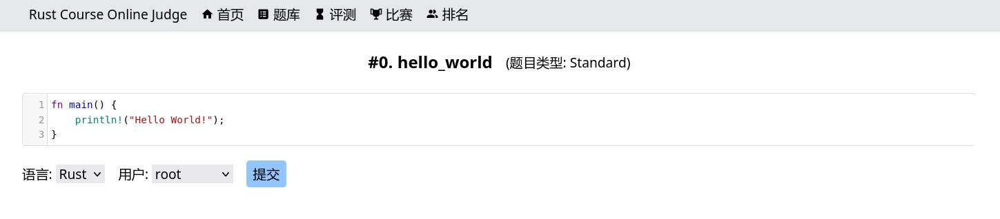
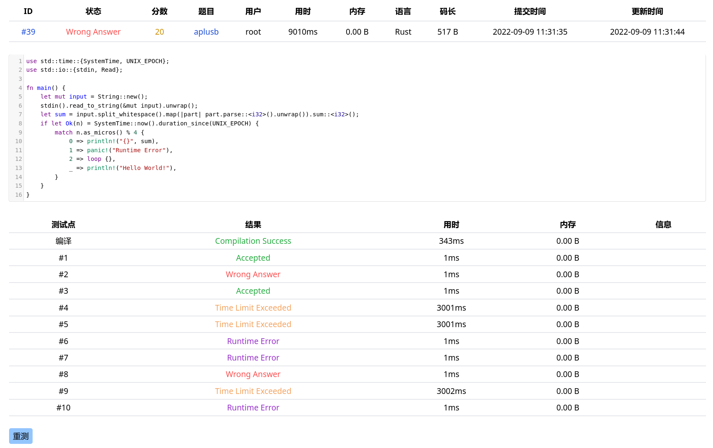
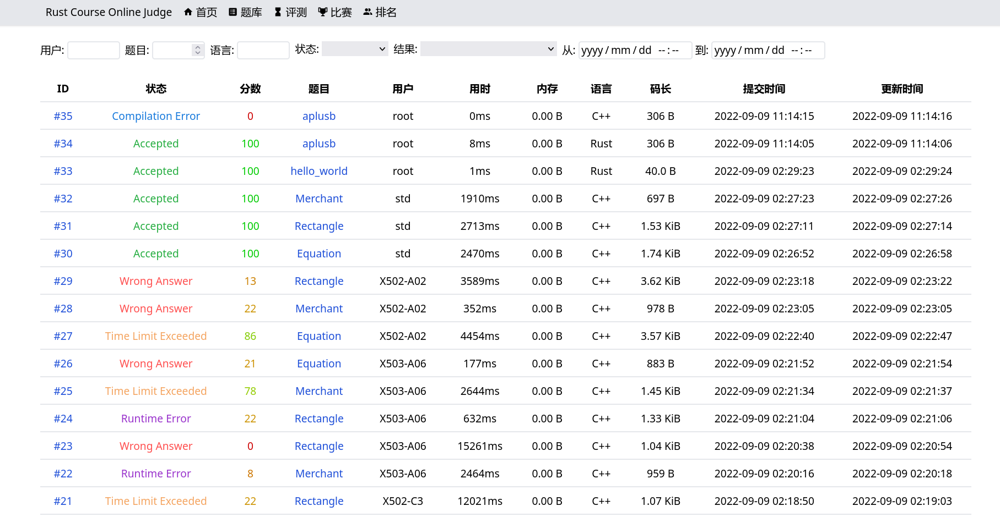
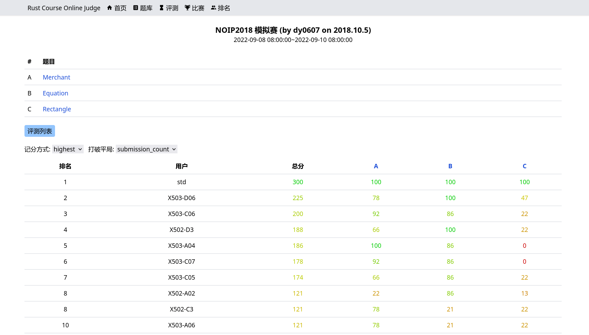

https://lab.cs.tsinghua.edu.cn/rust/2022/projects/oj/

# 大作业二：在线评测系统

## 代码结构

### 文件结构

-   `src`: Rust 代码
-   `migrations`: SQL schema
-   `frontend`: 前端代码
-   `db`: 用于存放数据库文件
-   `tmp`: 用于存放评测时的临时文件

### 模块树

-   `cli`: 解析命令行参数
-   `config`: 读取、解析、校验配置文件
    -   `deserialize`: 解析配置文件 JSON
-   `error`: 自定义错误类型，实现了从其它错误的转换以及转换为 API 响应
-   `db`: 数据库相关的操作
    -   `connection`: 获取与数据库的连接
    -   `migration`: 初始化数据库
    -   与各个数据库表格相关的操作：
        -   `case_results`
        -   `contests`
        -   `jobs`
        -   `users`
        -   `contest_problems`
        -   `contest_users`
    -   `enum`: 用于数据库中的枚举类型
    -   `utils`: 一些工具函数
    -   `schema`: 由 Diesel 自动生成
-   `judger`: 将任务添加至队列并执行
    -   `worker`: 执行任务
-   `routes`: API routes
    -   `jobs`
    -   `users`
    -   `contests`
        -   `ranklist`: 由于排行榜逻辑复杂，单独创建一个模块
    -   `languages` (用于前端)
    -   `problems` (用于前端)

## 提高功能

### Web 前端

依赖：

-   框架: [Vue](https://vuejs.org/)、[Vite](https://vitejs.dev/) （[TypeScript](https://www.typescriptlang.org/)）
-   CSS: [UnoCSS](https://github.com/unocss/unocss)
-   路由: [Vue Router](https://router.vuejs.org/)
-   代码编辑、显示: [CodeMirror 5](https://codemirror.net/5/)
-   杂项: [VueUse](https://vueuse.org/)、[filesize.js](https://github.com/avoidwork/filesize.js)、[date-fns](https://date-fns.org/)，详见 `package.json`

后端新增 API:

-   `/users/{id}`: 获取单个用户信息
-   `/languages`: 获取语言列表
-   `/problems`: 获取题目列表
-   `/problems/{id}`: 获取单个题目信息

界面展示（展示用的比赛提交是我以前参加过的一场模拟赛的真实题目数据、代码和用户名）：

### 数据库持久化存储

使用 [Diesel](https://diesel.rs) 和 Sqlite。

数据库建表详见代码中的 `migrations/2022-08-30-152344_create_tables/up.sql`。

通过执行 migration 初始化数据库，通过回退 migration 来实现 `--flush-data` 命令行参数（不直接删除文件主要是考虑到 `fs::remove_file` 不保证文件立刻被删除）。

使用 [`r2d2`](https://docs.rs/r2d2/) 创建连接池。

使用 [`diesel-derive-enum`](https://crates.io/crates/diesel-derive-enum) 以在 diesel 中将枚举作为数据库类型。

在执行需要保证一致性的查询时使用 [immediate transaction](https://www.sqlite.org/lang_transaction.html) 以保证一致性，并设置 [`busy_timeout`](https://www.sqlite.org/pragma.html#pragma_busy_timeout) 以避免出现 database locked error。

由于 diesel 的限制，为了方便与数据库交互，很多本可以 unsigned 的类型在代码中使用的是 `i32`。

### 非阻塞评测

采用非分离进程的评测队列架构：收到请求后在数据库中创建任务并通过 `judger::JobAdder` 使用 [`async-channel`](https://docs.rs/async-channel/) 将任务加入队列，每个 `judger::worker::Worker` 接到任务后进行评测。

在收到 `DELETE` 请求时将任务状态设为 `Canceled`，在接收到 `Canceled` 的任务时直接跳过。

还通过 `judger::JobWaiter` 实现了在正常退出时等待仍在运行的 `Worker` 完成评测。

### 其它提高功能

还实现了多比赛支持、打包测试、Special Judge、竞争得分，但实现方式没什么特别的。

## 感想

这次主要是写前端时的感想。这次小学期写了差不多一个月的 Rust，对 JavaScript（TypeScript）、Vue 已经有些生疏了，于是在开始写前端时感到很不习惯。后来，我发现，即使一定程度上习惯了 JS 或者说“复健成功”了，在接触了 Rust 之后再来写 JS，还是会感到一些“不适”，会反过来发现 Rust 的很多优点：说到 Rust 的优点，肯定避不开安全性以及 trait 这些，但这次 JS 复健后，我发现 Rust 的基础语法也设计的非常好，例如不带分号就可以作为返回值、控制流程语句开头没用的括号可以省略，这些细节都大大优化了编程的体验；而 `serde` 或者说 derive macro 的强大也让 JSON 类型检查变得十分轻松。
