https://lab.cs.tsinghua.edu.cn/rust/2022/projects/wordle/

# 大作业一：Wordle

## 代码结构

### 模块树

-   `args`: 获取所有参数
    -   `cli`: 解析命令行参数
    -   `json`: 解析配置文件
-   `game`: Wordle 的主逻辑，包括猜测和求解
-   `ui`: 各种 UI
    -   `test_mode`: 测试模式
    -   `interactive_mode`: 交互模式
    -   `gui`: GUI 的与逻辑线程通信部分
        -   `app`: GUI 的 GUI 部分
-   `stat`: 保存 state 以及计算统计信息
-   `word_set`: 获取单词列表
    -   `builtin_words`: 内置的默认单词列表
-   `valid_word`: 检查单词是否合法，使用 newtype pattern 将合法单词放在 `ValidWord` struct 中
-   `json`: 只有一个 `parse_json` 函数，是 `serde_json::from_str` 的简单包装，用于获取友好的错误信息

### UI 与逻辑的解耦

`ui` 模块的核心是 `trait UserInterface`，这个 trait 定义了 UI 所需的所有行为。

整个程序的核心逻辑位于函数 `wordle::run(args: &args::Args, ui: &impl ui::UserInterface) -> Result<()>`。

添加一个新的 UI 只需实现 `UserInterface` 并作为 `run` 的参数，无需修改其它代码，即可支持所有基础功能以及猜测中求解。

### 可执行文件

共有三个可执行文件：

-   `wordle`: 基础功能，以及猜测过程中的求解
-   `wordle-solver`: 交互式求解以及对整个词库求解
-   `wordle-gui`: （需要启用 `gui` feature flag）`wordle` 的图形界面版本，支持包括命令行参数、猜测过程中求解在内的完整功能

## 功能介绍

### 基础功能

参见作业文档。

### 交互模式

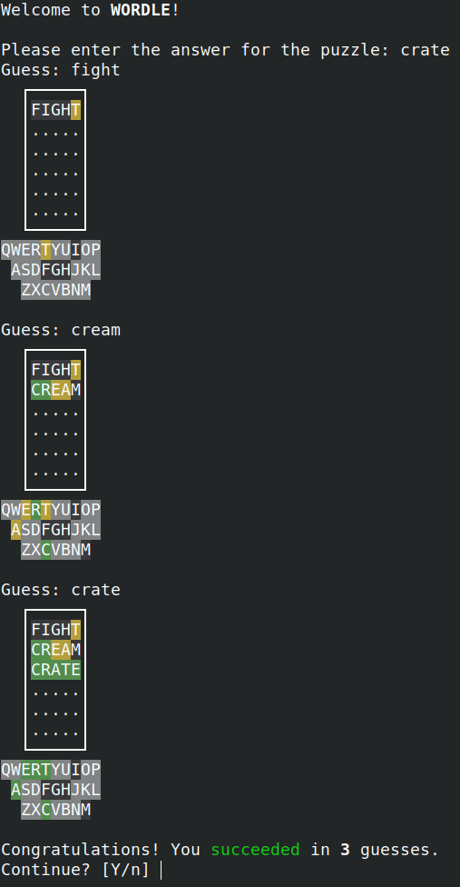

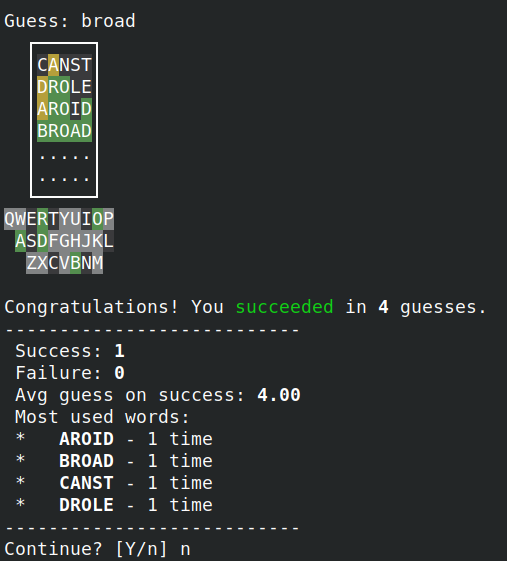

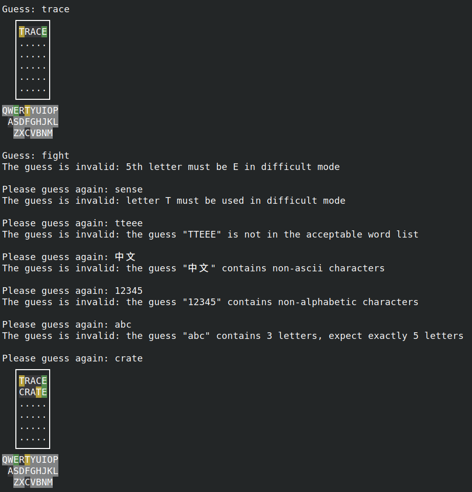

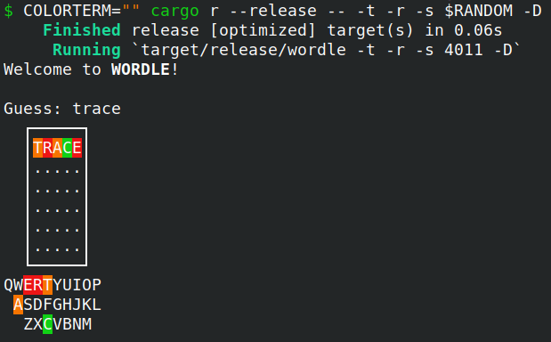

### 猜测过程中求解

即提高要求求解部分的前两项。

猜测过程中求解通过 `--enable-solver` 命令行参数启用，每次询问猜测时可以选择显示所有可能答案或给出推荐词。

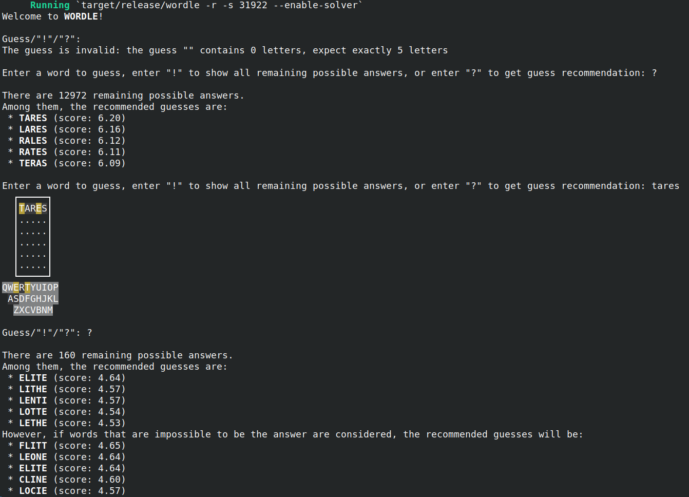

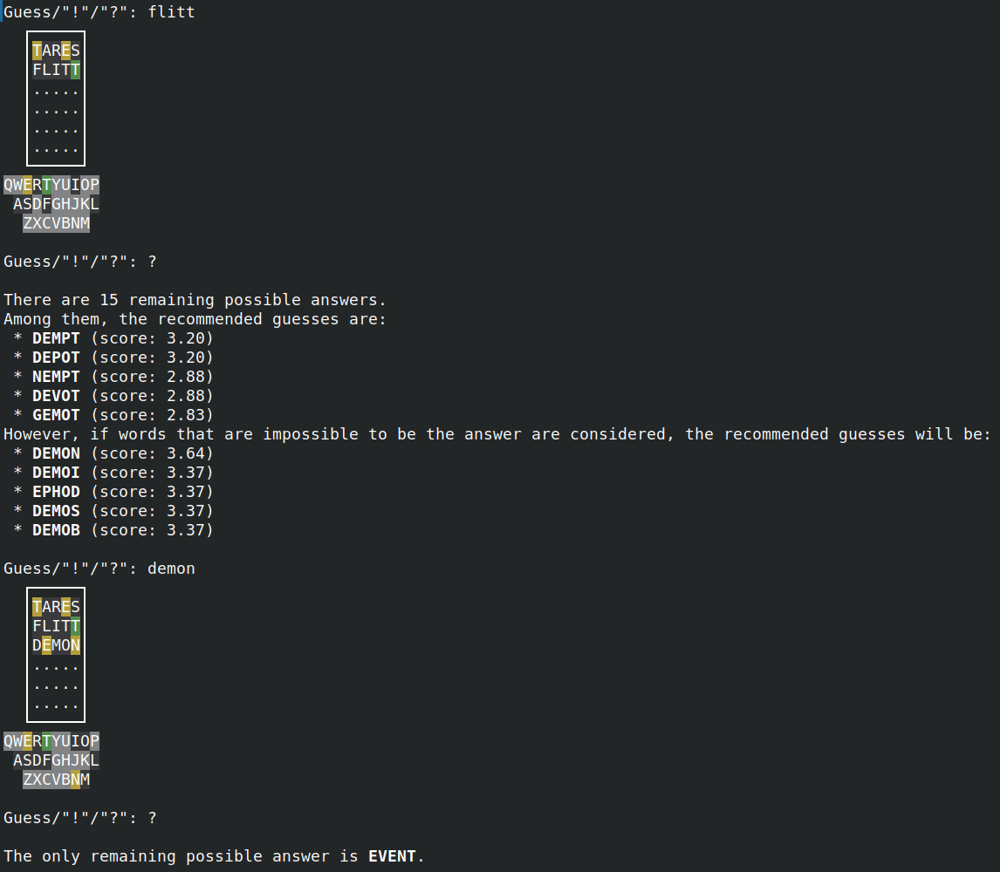

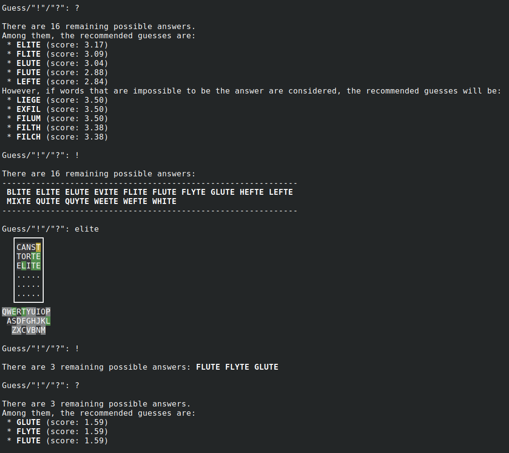

### 交互求解

即提高要求求解部分的第三项。

交互求解需要使用 `wordle-solver` 可执行文件。

每一步都可以输入任意猜测或使用 solver 给出的猜测，然后再手动输入颜色结果，最后会给出答案。

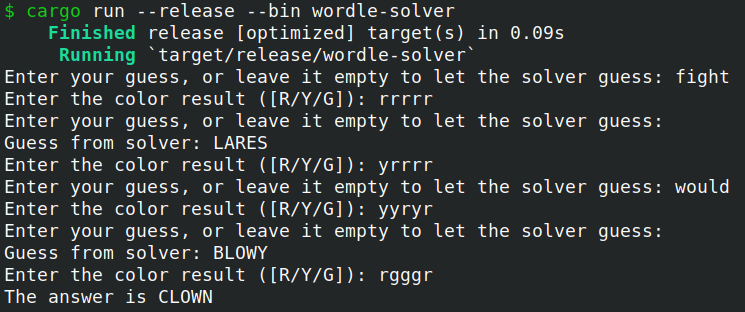

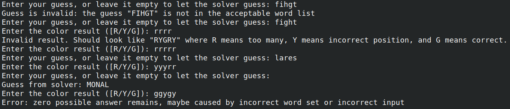

### 图形界面

GUI 通过可执行文件 `wordle-gui` 运行，需要 feature flag `gui`。界面高仿原版 Wordle。

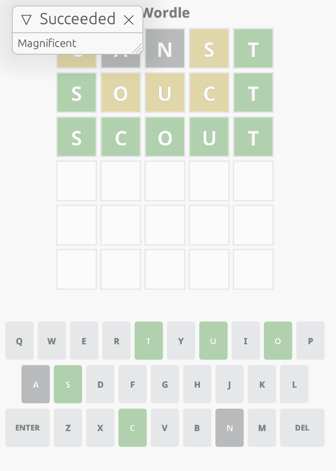

可以使用 solver:

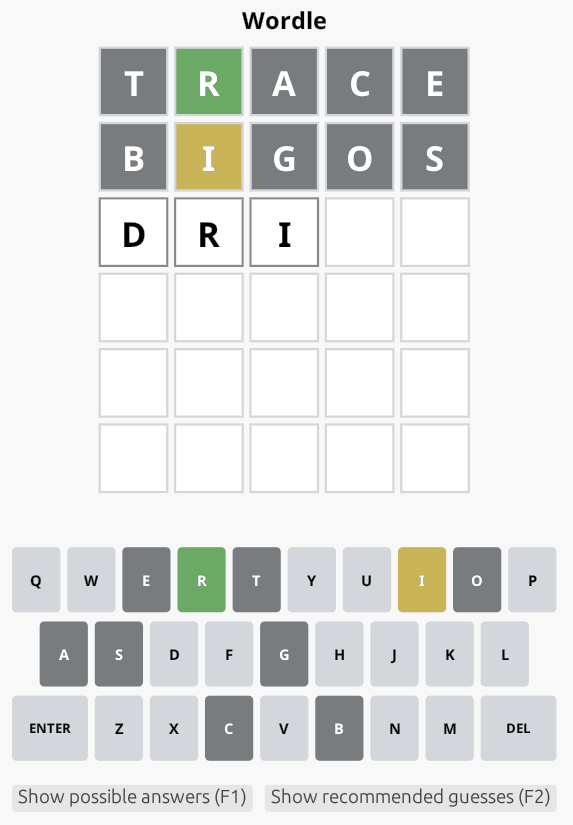

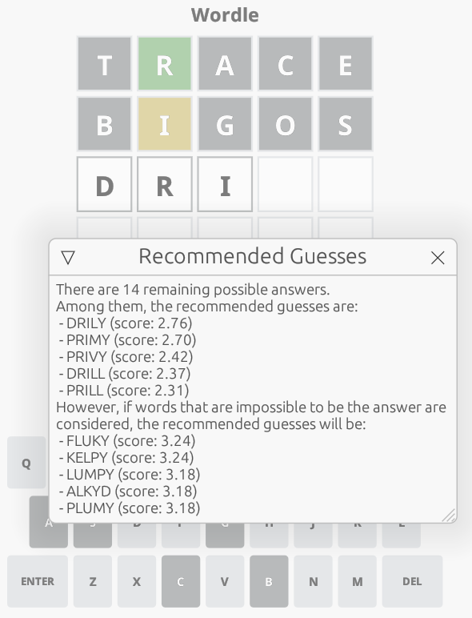

### 错误处理

使用 [`anyhow`](https://docs.rs/anyhow) 进行错误处理，同时显示友好的错误提示和包含错误原因的原错误信息。

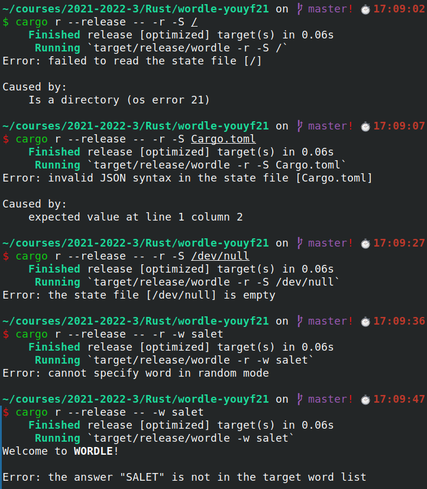

## 提高功能

### GUI

GUI 使用 [egui](https://docs.rs/egui) ([eframe](https://docs.rs/eframe)) 编写，分为逻辑和 GUI 两个线程，使用 `std::sync::mpsc::channel` 以及 `Arc<Mutex>` 进行通信。

主体有两个 struct，`wordle::ui::gui::Gui` 和 `wordle::ui::gui::app::App`，后者即 GUI 的主体部分，而前者通过实现 `UserInterface` trait 负责两个线程间的通信。

### 求解

求解使用的算法是计算单步信息熵，每次计算的复杂度为 acceptable set 大小乘上剩余可能答案的个数，在 release 模式下，如果限制使用单线程，计算初始词需要 5s 左右。使用了 [rayon](https://docs.rs/rayon/) 进行并行加速，在有多核 CPU 的电脑上优化明显。

可以使用 `wordle-solver` 的 `--benchmark-word` 或 `--benchmark-all` 对特定初始词在整个 final set 上进行测试（即提高要求求解部分的第四项）。benchmark 会对相同颜色的求解结果进行一定的缓存，再加上并行加速，在我 8 核 16 线程的 AMD Ryzen 7 4800H 上只需 4s 就可以完成对一个指定初始词的测试。

由于代码中存在一定的不确定性（对 acceptable HashSet 遍历的顺序不确定，导致同信息熵的词的相对顺序可能改变），每次测试的结果不会完全相同。测试表明，在我的算法下，较优的初始词是 "canst"、"clast"、"crost"、"talcs"，在普通模式下可以做到全对以及 3.96 左右的平均猜测次数，在困难模式下可以做到 97% 左右的正确率以及 4.1 左右的平均猜测次数。详细的测试结果可以查看代码的 `benchmark-results` 目录。

## 附加功能

还实现了分享成绩的功能，虽然没有分。通过 `--share` 参数启用。

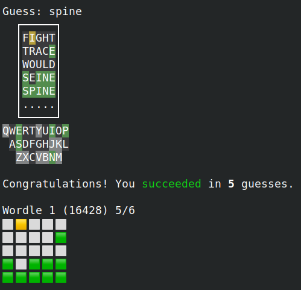

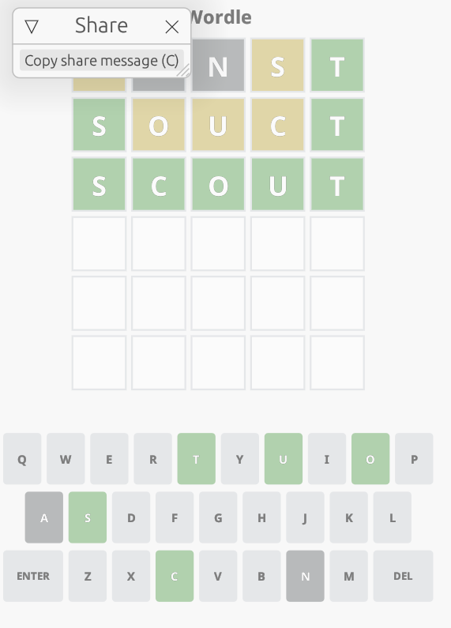

## 感想

作为信计专业的前 OIer，程设训练是我在清华的第一门编程课，Wordle 也是我人生中的第一份编程大作业。

以前写代码无非是两种情况，要么是像 OI 一样对所有输入输出都有非常精确的限定，要么是自己写项目没有明确的要求。而大作业则与这两种情况都不同，虽然有详细的说明文档，但也并非面面俱到。文档没有说明的地方，要么要向助教询问，要么要自己设计出合理的行为。这样一种“戴着镣铐跳舞”的感觉，让我明白了如何看待一份 specification，如何设计出一个合理又符合要求的项目。

当然，这也是我第一次写大作业这样规模的 Rust 代码，既是巩固了所学的知识，也在实践中体会到了 Rust 很多设计的安全与巧妙，以及一些依然不那么“安全”的地方。给我留下最深刻印象的有两处（很（不）巧，都是和并行以及 `Mutex` 相关的）：

一是求解器中一个死锁的修复。一开始发现死锁的时候我是完全没有头绪的，因为我知道死锁可以通过按顺序获取锁来避免，而我确信我自己写的锁都是按顺序获取的。而死锁又很难复现，经过了几个小时的调试我才将死锁出现的位置定位，是在我之前完全没有想到的内层代码。后来，在网上进行搜索之后，我终于找到了问题的根源: [在获取了 Mutex 的时候使用 rayon](https://github.com/rayon-rs/rayon/issues/592)。

二是对 GUI 部分两个线程之间通信方式的设计。一开始这个通信是以共享数据为主、channel 通信为辅的，让我挣扎了很久，后来换成以 channel 通信为主、共享数据为辅的设计，很快就写好了，让我深刻体会到了 [The Book 中引用](https://doc.rust-lang.org/book/ch16-02-message-passing.html)的“Do not communicate by sharing memory; instead, share memory by communicating”。
